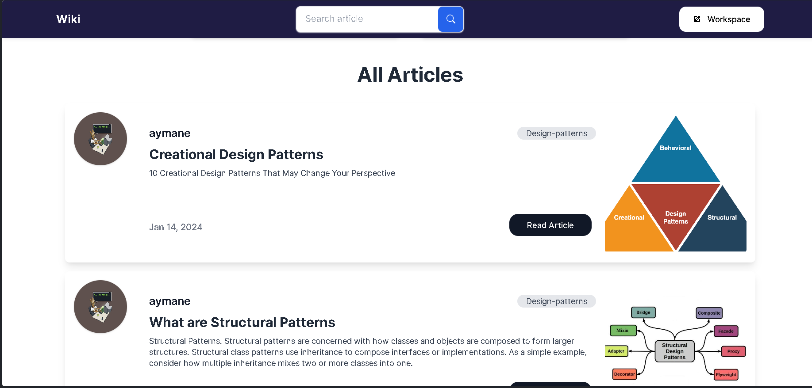
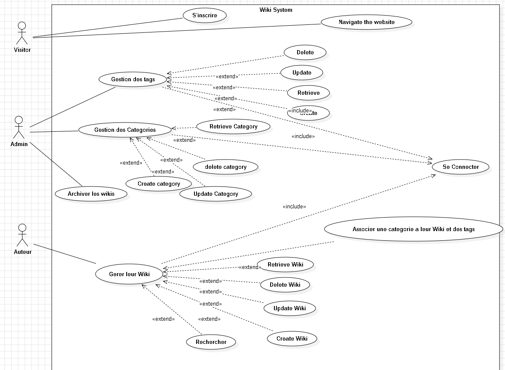

#  WIKI 

## Wiki™ : Explorez, Créez et Partagez des Savoirs Ensemble!


Wiki a besoin d'un système de gestionnaire de contenu efficace, associé à un front office, pour offrir une expérience utilisateur exceptionnelle.


## Jira Planification Link
https://aymaneelmaini.atlassian.net/jira/software/projects/WIKI/boards/11/backlog?epics=visible
## Presentation Link
https://prezi.com/view/Io3u1acl0u4uFDPtYIuO/
## Repository Link
https://github.com/AymaneTech/wiki


Clone the project repository:

```bash
> https://github.com/AymaneTech/wiki.git
```
```bash
> cd wiki
```
```bash
> code .
```


run the project

```Xampp
> Run the apache & mysql server using XAMPP
```

## Website preview





## Admin Dashboard UI


## Conception

Diagramme de Classes.




